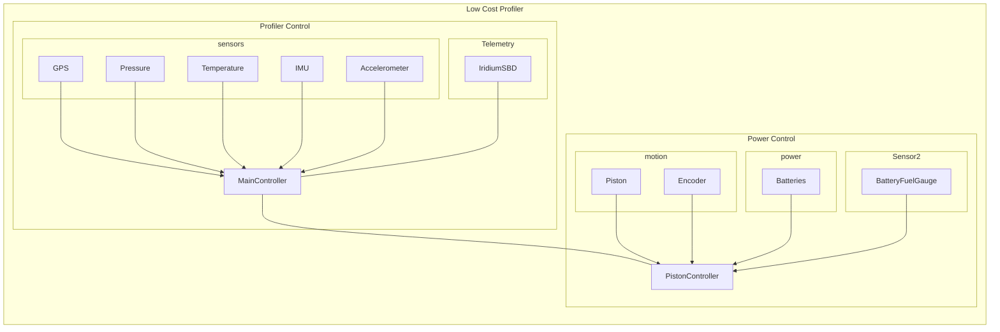

## Legal Disclaimer
### Software Disclaimer
*This repository is a software product and is not official communication 
of the National Oceanic and Atmospheric Administration (NOAA), or the 
United States Department of Commerce (DOC).  All NOAA GitHub project 
code is provided on an 'as is' basis and the user assumes responsibility 
for its use.  Any claims against the DOC or DOC bureaus stemming from 
the use of this GitHub project will be governed by all applicable Federal 
law.  Any reference to specific commercial products, processes, or services 
by service mark, trademark, manufacturer, or otherwise, does not constitute 
or imply their endorsement, recommendation, or favoring by the DOC. 
The DOC seal and logo, or the seal and logo of a DOC bureau, shall not 
be used in any manner to imply endorsement of any commercial product 
or activity by the DOC or the United States Government.*

### Hardware Disclaimer
*NOAA does not intend to patent this work worldwide. It may be used freely, but NOAA does not warrant its fitness for any use.*

*As a work of the United States Government, the associated schematics and software are in the public domain within the United States. Additionally, NOAA waives any potential copyright and related rights in the associated schematics and software worldwide through the Creative Commons Zero (CC0) 1.0 Universal Public Domain Declaration.*

# EDD-LCP_PistonDriver
Repository for LCP Piston Driver PCB design and firmware.

This repository is home to the piston driver PCB design and firmware for the low-cost-profiler project (likely to be renamed).

## GCC Build System
master_gcc branch is compatible with gcc compiler for MSP430 MCU. Please follow the steps below on the linux terminal.

* ./run_script.sh
* source ~/.bashrc
* cd Firmware/LCP_PistonDriver/
* make
* make flash

## State of this project
The LCP has been extensilivly tested and deployed in Puget Sound and the Bering Sea in Moored mode.  The mechanical design is complete, the electronics hardware needs a goround-up re-design for lower power consumption, decreased cost, and robustness.  The Firmware needs a ground up re-write for robustnuss and readability.  The piston board should be merged with the LCP-Control Board, and the seperate micro-controller elminated if possible.

# Branch
Master_gcc is the active branch and encompasses the most upto date version of the project 

# Low-Cost-Profiler
Low Cost Profiler for Oceanographic Monitoring

## Profiler System Diagram

